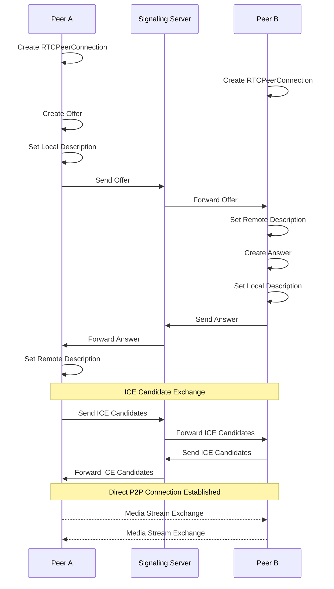

# info:
This repo is to help to reproduce bugs etc.
In the future there will be separate branches for this.

# required packages:
You must install essential host packages on your build host. The following command installs the host packages based on an Ubuntu distribution: (https://docs.yoctoproject.org/singleindex.html)
```
sudo apt install gawk wget git diffstat unzip texinfo gcc build-essential chrpath socat cpio python3 python3-pip python3-pexpect xz-utils debianutils iputils-ping python3-git python3-jinja2 libegl1-mesa libsdl1.2-dev pylint3 xterm python3-subunit mesa-common-dev zstd liblz4-tool
```
# checkout:
```
git clone --recurse-submodules https://github.com/thomas-roos/yocto_example.git
```
# build:
be aware that this can take several hours and needs up to 100GB disk space!
```
cd yocto_example
./build.sh
```
# test:
```
cd yocto_example
./test.sh
```
# this repo was created with:
```
mkdir yocto_example
cd yocto_example
git init
git submodule add -b master https://git.yoctoproject.org/poky
git submodule add -b master https://github.com/openembedded/meta-openembedded.git 
git submodule add -b master https://github.com/aws4embeddedlinux/meta-aws.git 
source poky/oe-init-build-env build
bitbake-layers add-layer ../meta-openembedded/meta-oe
bitbake-layers add-layer ../meta-openembedded/meta-python
bitbake-layers add-layer ../meta-openembedded/meta-networking
bitbake-layers add-layer ../meta-aws
bitbake-layers create-layer ../meta-example
bitbake-layers add-layer ../meta-example
git add conf/local.conf
git add conf/bblayers.conf
echo 'DL_DIR = "${TOPDIR}/../../downloads"' >> conf/site.conf 
echo 'SSTATE_DIR ?= "${TOPDIR}/../../sstate-cache"' >> conf/site.conf 
git add conf/bblayers.conf
cd ..
echo "build/*" >> .gitignore
git add .gitignore

manually change build/conf/bblayers.conf path
  ${TOPDIR}/../poky/meta \
  ${TOPDIR}/../poky/meta-poky \
  ${TOPDIR}/../poky/meta-yocto-bsp \
  ${TOPDIR}/../meta-openembedded/meta-oe \
  ${TOPDIR}/../meta-openembedded/meta-python \
  ${TOPDIR}/../meta-openembedded/meta-networking \
  ${TOPDIR}/../meta-aws \

git commit -m "Initial commit"
```

